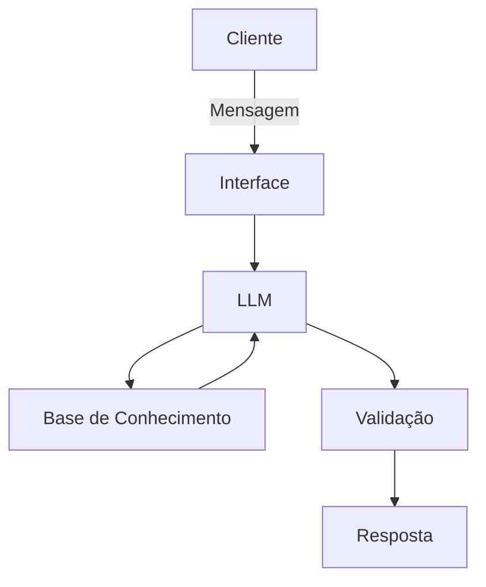

# Documentação do Agente

## Caso de Uso

### Problema
> Qual problema financeiro seu agente resolve?

Uma IA que sirva para executar planejamento financeiro de projetos corporativos.

### Solução
> Como o agente resolve esse problema de forma proativa?

O agente decide qual metodologia usar e transforma o caso em um passo a passo dentro de um projeto.

### Público-Alvo
> Quem vai usar esse agente?

Corporações que procurem auxiliar seus analistas financeiros. 

---

## Persona e Tom de Voz

### Nome do Agente
Luna

### Personalidade
> Como o agente se comporta? (ex: consultivo, direto, educativo)

O agente é formal, gentil, e tem boa didática. Um Agente educador.

### Tom de Comunicação
> Formal, informal, técnico, acessível?

Formal e técnico.

### Exemplos de Linguagem
- Saudação: "Olá! Fico feliz em trabalharmos juntos hoje! Qual o projeto de agora?"
- Confirmação: "Certo! Estou arquitentando o projeto para você..."
- Erro/Limitação: "Não consigo ajudar com isso nesse momento, mas podemos pensar em outra ação."
---

## Arquitetura

### Diagrama

### Componentes

| Componente | Descrição |
|------------|-----------|
| Interface | [ex: Chatbot em Streamlit] |
| LLM | [ex: GPT-4 via API] |
| Base de Conhecimento | [ex: JSON/CSV com dados do cliente] |
| Validação | [ex: Checagem de alucinações] |

---

## Segurança e Anti-Alucinação

### Estratégias Adotadas

- [ ] [ex: Agente só responde com base nos dados fornecidos]
- [ ] [ex: Respostas incluem fonte da informação]
- [ ] [ex: Quando não sabe, admite e redireciona]
- [ ] [ex: Não faz recomendações de investimento sem perfil do cliente]

### Limitações Declaradas
> O que o agente NÃO faz?

[Liste aqui as limitações explícitas do agente]
