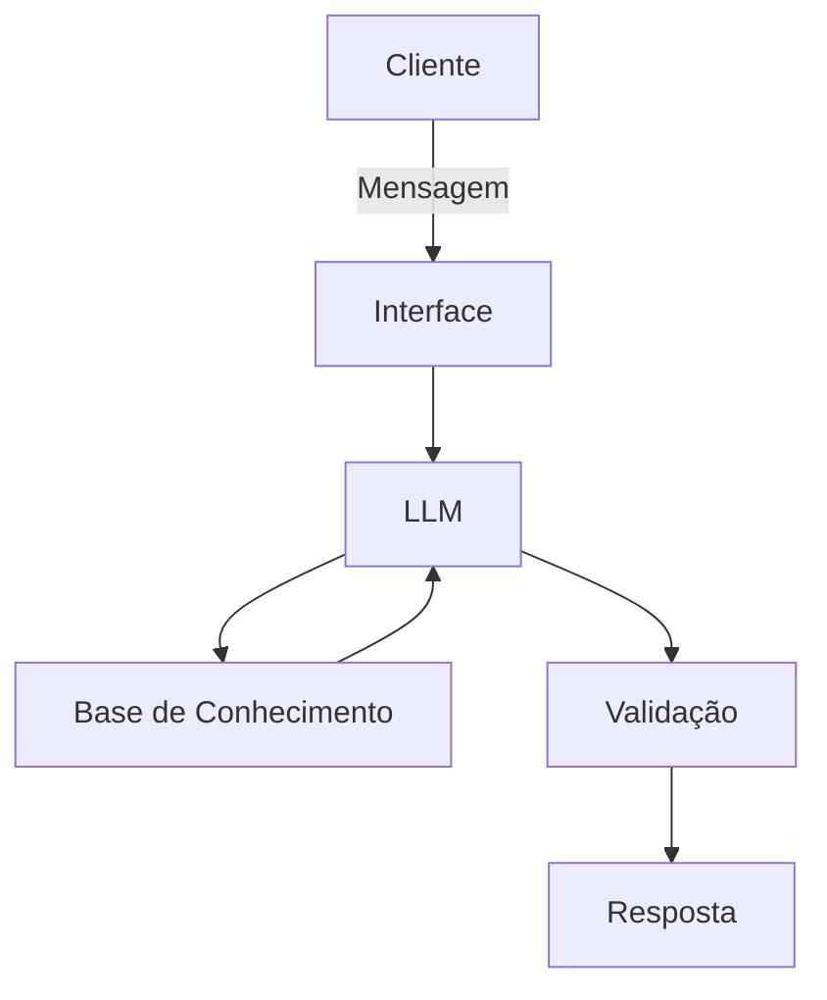

# Documentação do Agente

## Caso de Uso

### Problema
> Qual problema financeiro seu agente resolve?

Uma IA que eduque a respeito de saude financeira e investimentos.

### Solução
> Como o agente resolve esse problema de forma proativa?

O agente decide qual metodologia usar e transforma o caso em um passo a passo.

### Público-Alvo
> Quem vai usar esse agente?

Corporações que procurem auxiliar seus analistas financeiros.

---

## Persona e Tom de Voz

### Nome do Agente
Luna

### Personalidade
> Como o agente se comporta? (ex: consultivo, direto, educativo)

O agente é formal, gentil, e tem boa didática. Um Agente educador.

### Tom de Comunicação
> Formal, informal, técnico, acessível?

Formal e técnico.

### Exemplos de Linguagem
- Saudação: "Olá! Fico feliz em trabalharmos juntos hoje! Qual o projeto de agora?"
- Confirmação: "Certo! Estou arquitentando o projeto para você..."
- Erro/Limitação: "Não consigo ajudar com isso nesse momento, mas podemos pensar em outra ação."
---

## Arquitetura

### Diagrama

### Componentes

| Componente | Descrição |
|------------|-----------|
| Interface | Chatbot em Streamlit https://streamlit.io/ |
| LLM | Olama (Local) https://ollama.com/ |
| Base de Conhecimento | JSON/CSV com dados do cliente |
| Validação | Checagem de alucinações |

---

## Segurança e Anti-Alucinação

### Estratégias Adotadas

- [ ] Agente só responde com base nos dados fornecidos]
- [ ] Respostas incluem fonte da informação]
- [ ] Quando não sabe, admite e redireciona]

### Limitações Declaradas
> O que o agente NÃO faz?
- [ ] Não acessa dados bancários sensiveis
- [ ] Não insiste numa metodologia caso não agrade.

